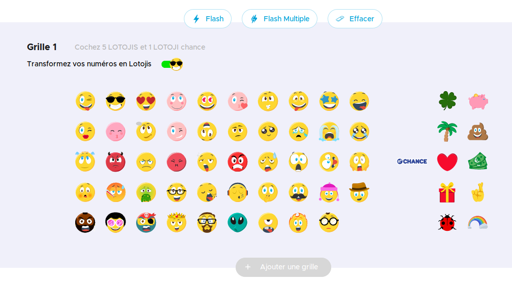

# Cent patates

*Using TensorFlow to select winning numbers on French lottery. A TensorFlow 2.0 tutorial with some nice combinatorics and a get-rich-quick click-bait title*

🥔🥔🥔🥔🥔🥔🥔🥔🥔🥔  
🥔🥔🥔🥔🥔🥔🥔🥔🥔🥔  
🥔🥔🥔🥔🥔🥔🥔🥔🥔🥔  
🥔🥔🥔🥔🥔🥔🥔🥔🥔🥔  
🥔🥔🥔🥔🥔🥔🥔🥔🥔🥔  
🥔🥔🥔🥔🥔🥔🥔🥔🥔🥔  
🥔🥔🥔🥔🥔🥔🥔🥔🥔🥔  
🥔🥔🥔🥔🥔🥔🥔🥔🥔🥔  
🥔🥔🥔🥔🥔🥔🥔🥔🥔🥔  
🥔🥔🥔🥔🥔🥔🥔🥔🥔🥔  

## Framing the question

First, let's get this out of the way: this **will not** increase your chance of winning. However, **if** you win, you win **bigger**! (Disclaimer: I'm just some random dude on the net, no legally-binding promises being made here).

The first sentence is based on the - rather unintuitive - fact that every combination have exactly the same chance of being drawn. Yes, the sequence 1 2 3 4 5 has the same chance of winning as 1 11 18 26 31! I mean, if we assume the balls are drawn uniformly, with no specific preference. And don't let the numbers deceive you: 4 is no closer to 5 than, say, 27. Their consecutiveness mean nothing. To convince yourself, you can substitute the numbers by friendly emojis. The French lottery's website even offers this, free of charge:

The aim here is to understand which numbers people choose the most, and avoid them. This reduces our chance of having to share the jackpot. So hold tight, this may save you a couple of millions of euros, you're welcome!

I've choosen the French lottery as the main example here, since this project was made in collaboration with the nice folks over [Le Mans' School of AI](https://www.meetup.com/Le-Mans-School-of-AI/), but the same logic can be applied to other styles as well. Besides, if you happen to be around, you're more than welcome to join us ;)

Finally, our question is: what is the chance of each being number being picked by players of the French lottery?

To simplify our scope we'll assume that this distribution is kept constant from draw to draw, ignoring any change of "popularity" of numbers overtime. This shift in people's behavior could happen if, for example, a given number gets a bad name or, the other way, becomes more popular due to recent events.

## Background: how the French lottery works

I'll spare your time and pick the most important bits of the [30-page-long document](https://www.fdj.fr/static/contrib/files/pdf/2018-11-24_R%C3%A8glement_LOTO_0.pdf) for us here:

1. each player have to pick 5 numbers from 1 to 49 (inclusive) without replacement (that is, they can't repeat) and 1 number (called *lucky number*) from 1 to 10 (inclusive)
2. the order doesn't matter
3. after all players have placed their bets, the house does the same (5 numbers from 1 to 49 and 1 number from 1 to 10)
4. the jackpot is shared by players that get all 6 numbers right
5. fixed prizes are offered in the following cases:

|                          |   | Correct "lucky" number     |              |
|--------------------------|---|----------------------------|--------------|
|                          |   | 1                          | 0            |
| Correct "normal" numbers | 5 | Jackpot (≥ 2 000 000.00 €) | 100 000.00 € |
|                          | 4 | 1 000.00 €                 | 500.00 €     |
|                          | 3 | 50.00 €                    | 20.00 €      |
|                          | 2 | 10.00 €                    | 5.00 €       |
|                          | 1 | 2.20 €                     | -            |
|                          | 0 | 2.20 €                     | -            |

## Available data

For our supervised learning we'll need data, lots of! The French lottery has not changed much since 6 October 2008, and they kindly release [historical data](https://www.fdj.fr/jeux-de-tirage/loto/) for the world to use. As of this date, they provide this data segmented into three files that are also available in this repo:

1. from October 2008 to March 2017: `raw_data/loto_200810.zip`
2. from March 2017 to February 2019: `raw_data/loto_201703.zip`
3. after February 2019: `raw_data/loto_201902.zip`

The is some boring work involved in unzipping, reformatting and merging all this data into something easier to use. I'll spare you with the details of the `unzip_reformat_merge.py` file and show you part of the output (available at `data/data.csv`).
