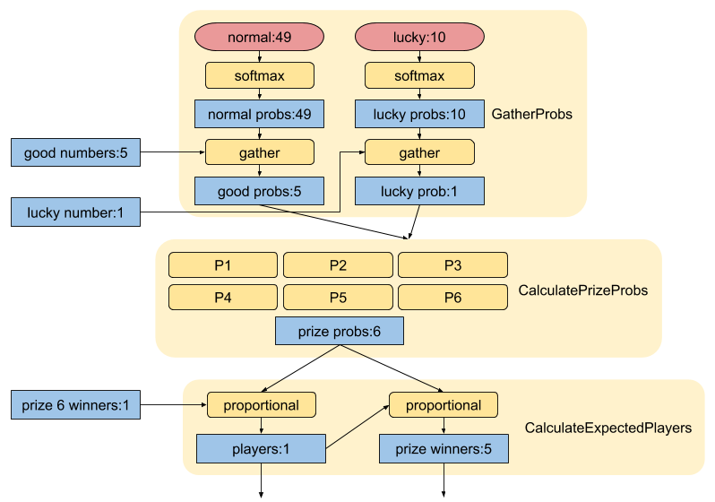
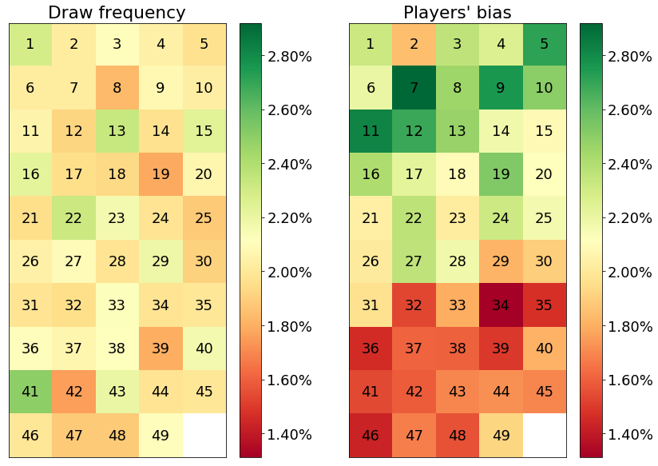
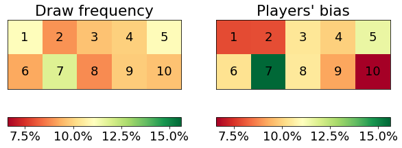

# Cent patates

*Using TensorFlow to win 65 time more in the French lottery. A TensorFlow 2.0 tutorial with some nice combinatorics and a get-rich-quick click-bait title*

🥔🥔🥔🥔🥔🥔🥔🥔🥔🥔  
🥔🥔🥔🥔🥔🥔🥔🥔🥔🥔  
🥔🥔🥔🥔🥔🥔🥔🥔🥔🥔  
🥔🥔🥔🥔🥔🥔🥔🥔🥔🥔  
🥔🥔🥔🥔🥔🥔🥔🥔🥔🥔  
🥔🥔🥔🥔🥔🥔🥔🥔🥔🥔  
🥔🥔🥔🥔🥔🥔🥔🥔🥔🥔  
🥔🥔🥔🥔🥔🥔🥔🥔🥔🥔  
🥔🥔🥔🥔🥔🥔🥔🥔🥔🥔  
🥔🥔🥔🥔🥔🥔🥔🥔🥔🥔  

## Framing the question

First, let's get this out of the way: this **will not** increase your chance of winning. However, **if** you win, you win **bigger**! (Disclaimer: I'm just some random dude on the net, no legally-binding promises being made here).

The first sentence is based on the - rather unintuitive - fact that every combination have exactly the same chance of being drawn. Yes, the sequence 1 2 3 4 5 has the same chance of winning as 1 11 18 26 31! I mean, if we assume the balls are drawn uniformly, with no specific preference. And don't let the numbers deceive you: 4 is no closer to 5 than, say, 27. Their consecutiveness means nothing. To convince yourself, you can substitute the numbers by friendly emojis. The French lottery's website even offers this free of charge:


The strategy here is to understand which numbers people choose the most, and avoid them. This reduces our chance of having to share the jackpot. So hold tight, this may save you a couple of millions of euros. You're welcome!

I've chosen the French lottery as the main example here, since this project was made in collaboration with the nice folks over [Le Mans' School of AI](https://www.meetup.com/Le-Mans-School-of-AI/), but the same logic can be applied to other styles as well. Besides, if you happen to be around, you're more than welcome to join us ;)

Finally, our question is: "What is the chance of each being number being picked by players of the French lottery?"

To simplify our scope we'll assume that this distribution is kept constant from draw to draw, ignoring any change of "popularity" of numbers overtime. This shift in people's behavior could happen if, for example, a given number gets a bad name or, the other way, becomes more popular due to recent events.

## Background: how the French lottery works

I'll spare your time and pick the most important bits of the [30-page-long document](https://www.fdj.fr/static/contrib/files/pdf/2018-11-24_R%C3%A8glement_LOTO_0.pdf) for us here:

1. each player have to pick 5 numbers from 1 to 49 (inclusive) without replacement (that is, they can't repeat) and 1 number (called *lucky number*) from 1 to 10 (inclusive)
2. the order doesn't matter
3. after all players have placed their bets, the house does the same (5 numbers from 1 to 49 and 1 number from 1 to 10)
4. the jackpot is shared by players that get all 6 numbers right
5. fixed prizes are offered in the following cases:

|                          |   | Correct "lucky" number     |              |
|--------------------------|---|----------------------------|--------------|
|                          |   | 1                          | 0            |
| Correct "normal" numbers | 5 | Jackpot (≥ 2 000 000.00 €) | 100 000.00 € |
|                          | 4 | 1 000.00 €                 | 500.00 €     |
|                          | 3 | 50.00 €                    | 20.00 €      |
|                          | 2 | 10.00 €                    | 5.00 €       |
|                          | 1 | 2.20 €                     | -            |
|                          | 0 | 2.20 €                     | -            |

## Available data

For our supervised learning we'll need data, lots of! The French lottery has not changed much since 6 October 2008, and they kindly release [historical data](https://www.fdj.fr/jeux-de-tirage/loto/) for the world to use. As of this date, they provide this data segmented into three files that are also available in this repo:

1. from October 2008 to March 2017: `raw_data/loto_200810.zip`
2. from March 2017 to February 2019: `raw_data/loto_201703.zip`
3. after February 2019: `raw_data/loto_201902.zip`

The is some boring work involved in unzipping, reformatting and merging all this data into something easier to use. I'll spare you with the details of the `unzip_reformat_merge.py` file and show you part of the output (available at `data/data.csv`):

```csv
ball_1,ball_2,ball_3,ball_4,ball_5,date,jackpot,lucky_ball,wins_1_1_and_0_1,wins_2_1_and_2_0,wins_3_1_and_3_0,wins_4_1_and_4_0,wins_5_0,wins_5_1
28,14,37,32,4,04/03/2017,0,4,585454,394534,26910,617,1,0
33,31,16,46,20,01/03/2017,0,5,494834,265105,17202,359,0,0
```

The columns from `ball_1` to `ball_5` represent the 5 "normal" numbers, `date` the draw date, `jackpot` the total amount of the greater prize, before dividing between winners (FN1). `wins_5_1` represents the number of winners that shared the jackpot, `wins_5_0` represents the winners of the second prize (100 000.00 €)(FN2) and so on(FN3).

*(FN1) before March 2017, this data is missing (provided as zero) when nobody won the jackpot*  
*(FN2) the value of some prizes changed over time. This is the current rule*  
*(FN3) even though there are currently nine prize categories, for compatibility with historical data before March 2017 we'll consider only six*

## Modeling

Our model is not like traditional neural networks, in the sense that we won't use any classical layer like _Dense_, _Convolutional_, etc. We'll instead develop our own domain-specific layers and reuse all TensorFlow and Keras machinery to optimize the weights for fun and profit.

The diagram below depicts our model with:

1. three inputs: the 5 good numbers (1 to 49), the lucky number (1 to 10), the number of winners of the 6th level prize
2. two weigths: the likelihood of people choosing each one of the 49 normal numbers and the 10 lucky ones
3. three layers, explained below
4. two outputs: the expected number of players and the expected number of winners in each of the other 5 categories



(Tensors in blue, operations in yellow, weights in red)

If things aren't clear, don't panic, it will be clearer in a minute, I promisse!

Remember: we're dealing with six prize categories (wins_1_1_and_0_1, wins_2_1_and_2_0, wins_3_1_and_3_0, wins_4_1_and_4_0, wins_5_0, wins_5_1). For brevity, I'll refer to them as 1, 2, ..., 6, in that order. The heart of the model are 6 formulas (P1, P2, ..., P6) that give the likelihood of a player choosing numbers that would award them with that level's prize. These formulas are detailed and explained in [another notebook](Probability%20formulas.ipynb). For this discussion, let's simply assume they work and take as inputs the likelihood of player choosing each one of the 5 good numbers and the good lucky number: `prob_i = P_i(good probs, lucky probs)`. This is done by the intermediate layer `CalculatePrizeProbs`.

However, in our dataset we have the *number* of players that won. So we need to convert that probability into the expected number of winners. That's easy when we have the total number of players: `winners_i = players * prob_i`, but we don't! Sadly it seems like this is not a public information.

We won't give up! We can instead tip this last equation over and estimate the number of players from one of the prizes `players = winners_6 / prob_6`. I've choosen the sixth level, since it has a greater number of winners, increasing the confidence of our estimative. 

Now the output of the model is complete: the expected number of players and the expected number of winners in the first five levels, implemented at `CalculateExpectedPlayers` layers.

The last piece of the puzzle is the first layer. It's the only layer that have trainable weights and they are exact what we're after: the probability of a player choosing each individual number from the two complete pool of numbers (1 to 49 and 1 to 10). It receives as input the good numbers, say `[[3, 14, 15, 35, 32], [3]]`, and uses the standard `tf.gather` operation to index into the weights vectors.

One important detail here is the `softmax(X) = exp(X) / sum(exp(X))` operation: it's used to convert arbitrary floats (logit scores) into valid probabilities, ensuring that they add up to one and are all non-negative. This operation is commonly used in the context of probabilities and classification, there are lots of online material if you want to dig further.

With Keras, one can implement their own layers and them describe model in a functional API, like:

```python
# Build the model: define inputs
good_numbers = tf.keras.layers.Input(shape=(5,), dtype='int32')
lucky_number = tf.keras.layers.Input(shape=(1,), dtype='int32')
prize_6_winners = tf.keras.layers.Input(shape=(1,), dtype='int32')

# Build the model: define layers
good_probs, lucky_prob = GatherProbsLayer()([good_numbers, lucky_number])
prize_probs = CalculatePrizeProbs()([good_probs, lucky_prob])
players, prize_winners = CalculateExpectedPlayers()([prize_6_winners, prize_probs])

# Build the model
model = tf.keras.Model(
	inputs=[good_numbers, lucky_number, prize_6_winners],
	outputs=[players, prize_winners])
```

## Training

You may have noticed the expected number of players is an output in the model we don't have! Fortunately, Keras allow us to ignore this output in our training and loss function. We'll also use a custom loss function for the expected winners output that is based on the classic mean_squared_error, but with a small tweak.

To understand why, take a look at one sample output: `[1, 0, 404, 20067,  308791]`. An error of 1 player in the first element (jackpot winners) is much more relevant than an error of 1 in the last (5th level winners). So we calculate the average value for each output and use it as weights in our custom loss.

The training code is then:

```python
avg_winners = np.mean(output_values, axis=0)
def custom_loss(y_true, y_pred):
    normalized_error = (y_pred - y_true) / avg_winners
    return tf.reduce_mean(tf.math.square(normalized_error), axis=1)
model.compile(optimizer='adam', loss=[None, custom_loss])
model.fit(train_inputs, train_output)
```

## Results

The trained model is persisted and loaded in a [notebook that displays the results](Results.ipynb). You should definitively check it, players have really strong preferences!! Some spoiler:



